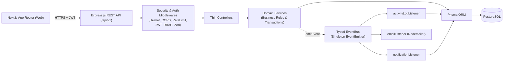
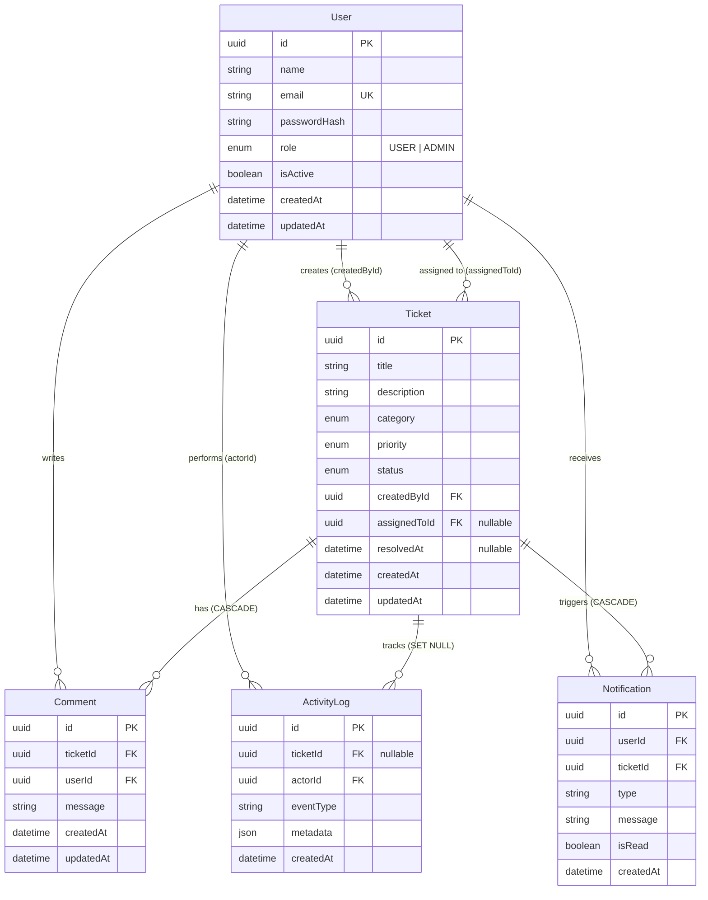
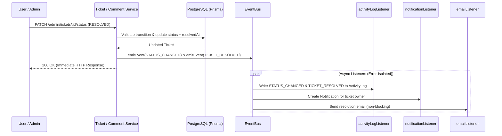

# System Diagrams

## 1. System Architecture

```mermaid
flowchart LR
    Client["Next.js App Router (Web)"] -->|HTTPS + JWT| API["Express.js REST API (/api/v1)"]
    API --> MW["Security & Auth Middlewares\n(Helmet, CORS, RateLimit, JWT, RBAC, Zod)"]
    MW --> Ctrl["Thin Controllers"]
    Ctrl --> Svc["Domain Services\n(Business Rules & Transactions)"]
    Svc --> Prisma["Prisma ORM"]
    Prisma --> PG[("PostgreSQL")]
    Svc -.->|emitEvent| Bus["Typed EventBus\n(Singleton EventEmitter)"]
    Bus --> L1["activityLogListener"]
    Bus --> L2["notificationListener"]
    Bus --> L3["emailListener (Nodemailer)"]
    L1 --> Prisma
    L2 --> Prisma
```

## 2. Entity-Relationship (ER) Diagram

```mermaid
erDiagram
    User ||--o{ Ticket : "creates (createdById)"
    User ||--o{ Ticket : "assigned to (assignedToId)"
    User ||--o{ Comment : "writes"
    User ||--o{ ActivityLog : "performs (actorId)"
    User ||--o{ Notification : "receives"
    Ticket ||--o{ Comment : "has (CASCADE)"
    Ticket ||--o{ ActivityLog : "tracks (SET NULL)"
    Ticket ||--o{ Notification : "triggers (CASCADE)"

    User {
        uuid id PK
        string name
        string email UK
        string passwordHash
        enum role "USER | ADMIN"
        boolean isActive
        datetime createdAt
        datetime updatedAt
    }

    Ticket {
        uuid id PK
        string title
        string description
        enum category
        enum priority
        enum status
        uuid createdById FK
        uuid assignedToId FK "nullable"
        datetime resolvedAt "nullable"
        datetime createdAt
        datetime updatedAt
    }

    Comment {
        uuid id PK
        uuid ticketId FK
        uuid userId FK
        string message
        datetime createdAt
        datetime updatedAt
    }

    ActivityLog {
        uuid id PK
        uuid ticketId FK "nullable"
        uuid actorId FK
        string eventType
        json metadata
        datetime createdAt
    }

    Notification {
        uuid id PK
        uuid userId FK
        uuid ticketId FK
        string type
        string message
        boolean isRead
        datetime createdAt
    }
```

## 3. Event-Driven Workflow

```mermaid
sequenceDiagram
    participant U as User / Admin
    participant S as Ticket / Comment Service
    participant DB as PostgreSQL (Prisma)
    participant B as EventBus
    participant A as activityLogListener
    participant N as notificationListener
    participant E as emailListener

    U->>S: PATCH /admin/tickets/:id/status (RESOLVED)
    S->>DB: Validate transition & update status + resolvedAt
    DB-->>S: Updated Ticket
    S->>B: emitEvent(STATUS_CHANGED) & emitEvent(TICKET_RESOLVED)
    S-->>U: 200 OK (Immediate HTTP Response)
    par Async Listeners (Error-Isolated)
        B->>A: Write STATUS_CHANGED & TICKET_RESOLVED to ActivityLog
        B->>N: Create Notification for ticket owner
        B->>E: Send resolution email (non-blocking)
    end
```
